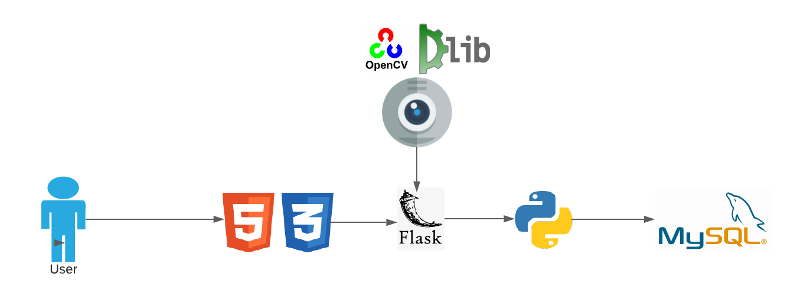

# Team-Project-3

## AttentiveJoe
### Problem Statement
Nowadays, Online video education is steadily becoming more important. The reasons are not only geographical differences between the teacher and the student, but also new teaching concepts such as “flipped classroom" and various other factors as well. In the U.S.A. nearly 60% of the students use online education. Recently the pandemic has made all the modes of teachings virtual which even more emphasizes the need to build this system.

### Abstract
Learning through online video is extremely popular. But there's no way to determine whether a student is actively participating in a lecture. An algorithm for real-time eye and lips state classification employing a simple webcam is presented. Here a simulation of an online class platform, to detect the Attentiveness of students, is developed during which the eyes and lips of the person seated ahead of the camera are detected employing python libraries.

### Approach
We used techniques like face and eye detection, eye tracking, and yawn detection. For eye detection, there are two different eye positions: open and closed are classified with the assistance of cv2 python library of detecting eyes. For yawning detection, facial landmarks are created which captures the landmark points of top and bottom lip and calculates the distance of lips. Supported by these a prediction is formed to state whether the attendant is Attentive or not during the class.

### Architecture Diagram 

### Persona
1. Educational Institutions
2. Students
